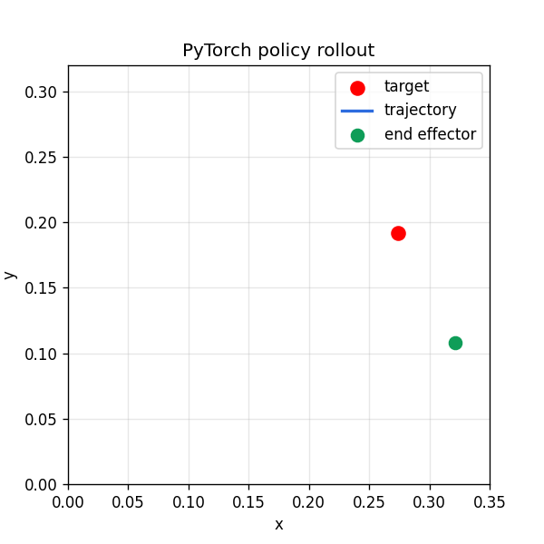
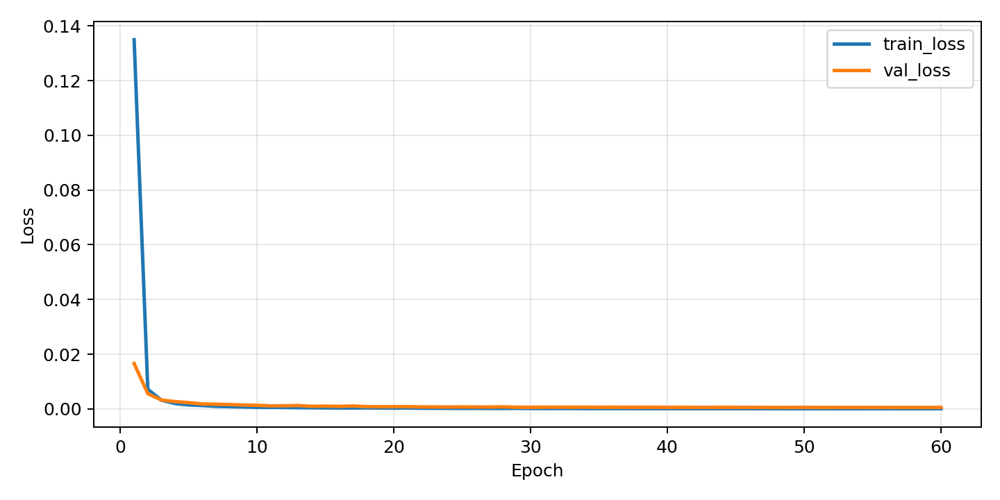

# mujoco-sim-debugging-playbook

> A support-first MuJoCo project for reproducing simulation failures, running parameter sweeps, training a PyTorch policy, and packaging diagnostics, docs, and artifacts around robot control behavior.

## Simulation Role Entry Point

If you are reviewing this for autonomous construction or robotics simulation work, start here:

- [Application packet](outputs/application_packet/application_packet.md): shortest forwardable summary with proof points and outreach message
- [Application bundle](outputs/application_bundle/application_bundle.md): index of sendable/reviewable artifacts with audiences and checksums
- [Application readiness](outputs/application_readiness/application_readiness.md): pass/fail gate for sendable artifacts and public wording
- [Interview assets](outputs/interview_assets/interview_assets.md): resume bullets, phone-screen story, and questions to invite
- [Earthmoving simulation packet](EARTHMOVING_SIMULATION_PACKET.md): concise role-focused summary, metrics, limitations, and review links
- [Hiring manager packet](outputs/hiring_manager_packet/hiring_manager_packet.md): manager-oriented review path, technical judgment signals, limitations, and next 30-day plan
- [Field trial visuals](outputs/field_trial_visuals/field_trial_visuals.md): terrain delta, blade path, and productivity bottleneck plots
- [Field trial case study](outputs/field_trial_case_study/field_trial_case_study.md): scenario-level replay, observations, root-cause hypotheses, and next experiment
- [Multi-pass plan evaluation](outputs/multipass_plan_eval/multipass_plan_eval.md): single-pass vs multi-pass task sequence comparison
- [Task plan robustness sweep](outputs/task_plan_robustness/task_plan_robustness.md): selected task plan under soil and cycle-time uncertainty
- [Robustness sensitivity](outputs/robustness_sensitivity/robustness_sensitivity.md): ranked uncertainty drivers for productivity misses
- [One-month robotics simulation plan](ONE_MONTH_ROBOTICS_SIMULATION_PLAN.md): full-time project curriculum for becoming useful in autonomy simulation roles
- [Outreach note](OUTREACH_NOTE.md): repo strategy and a short recruiter update draft
- [Earthmoving dashboard](outputs/earthmoving_dashboard/index.html): static dashboard for terrain deformation, calibration, scale, and planning artifacts
- [Earthmoving benchmark guide](docs/earthmoving-benchmark-guide.md): command map and artifact map for the construction simulation track
- [Jobsite autonomy evaluation](outputs/jobsite_autonomy_eval/report.md): deployment-style cycle-time, productivity, target-placement, and rework-risk scorecard
- [C++ terrain kernel](cpp/terrain_kernel.cpp): standalone terrain-update kernel with smoke build via `make terrain-kernel-smoke`
- [C++ terrain benchmark](outputs/terrain_kernel_benchmark/report.md): Python vs C++ terrain-update benchmark via `make terrain-kernel-benchmark`
- [Rust simulation kernel note](docs/rust-simulation-kernel-note.md): why Rust can matter for simulation infrastructure, with an optional Rust FFI terrain-kernel scaffold
- [Native kernel matrix](outputs/native_kernel_matrix/report.md): Python/C++/Rust availability and speed comparison via `make native-kernel-matrix`

The earthmoving track demonstrates a MuJoCo dozer/blade scene, heightmap terrain deformation, soil parameter calibration, randomized scale evaluation, jobsite productivity scoring, task-plan robustness sweeps, quality gates, deterministic replay bundles, ML-ready datasets, a surrogate evaluator, simulator-in-the-loop blade plan search, C++ and optional Rust terrain-kernel scaffolds, and generated review artifacts.

## Why this exists

This repo is designed to be more than "a robot moving in simulation."

It is deliberately structured like a miniature simulation support lab:

- a reproducible robot task
- parameter sensitivity experiments
- support-case reproduction artifacts
- user-facing debugging docs
- issue templates, CI, Docker, and contributor workflows

It demonstrates:

- robotics simulation familiarity with MuJoCo
- Python engineering around experiments and reproducibility
- debugging instincts around unstable or degraded control behavior
- clear technical writing for user enablement
- support-triage thinking for user-reported failures
- PyTorch fluency through a learned imitation baseline, training curves, checkpoints, and evaluation rollouts
- construction-style earthmoving simulation with terrain deformation, soil calibration, and scale studies
- C++ implementation experience through a standalone terrain-update kernel and smoke build
- Linux-style tooling with bash, Docker, CI, and GitHub workflows

The original core task is a planar 2-DoF robotic arm reaching for sampled workspace targets. A baseline inverse-kinematics-plus-PD controller is evaluated while varying important simulation and control parameters such as damping, actuator gain, noise, delay, and control frequency. The repo also includes an earthmoving benchmark built around a small MuJoCo dozer/blade asset, a heightmap terrain deformation model, soil parameter calibration, and batch throughput reporting.

## Project highlights

- Baseline reaching controller using analytical inverse kinematics
- Config-driven experiment runner for repeatable sweeps
- Metrics for convergence, overshoot, oscillation, control effort, and success rate
- Plot generation for parameter sensitivity studies
- Markdown report generation summarizing results
- Troubleshooting guide that frames the repo like a simulation support/debugging playbook
- Support-case library with response-draft generation
- Diagnostics bundles with environment capture and scenario comparisons
- PyTorch imitation-learning pipeline with dataset generation, training, and policy evaluation
- Online RL fine-tuning stage that adapts the imitation policy inside MuJoCo
- Static dashboard for browsing artifacts, environment details, and support cases
- Multi-controller benchmark comparing expert, learned, and guarded hybrid control
- Domain-randomization evaluation that measures policy robustness under changing physics
- Earthmoving benchmark with a MuJoCo dozer/blade asset, terrain before/after plots, and target-berm metrics
- Heightmap terrain deformation with soil cohesion, friction, compaction, coupling, spillover, and volume accounting
- Sim-to-field calibration tooling that fits soil/deformation parameters against observed construction-style logs
- Jobsite autonomy evaluation that turns sim results into cycle-time, productivity, target-capture, and rework-risk decisions
- Task-plan robustness sweeps that stress selected blade plans against soil and cycle-time uncertainty
- Batch scale study for randomized earthmoving scenarios with runtime and episodes-per-second reporting
- Standalone C++ terrain kernel with a smoke build for low-level geometry/physics implementation practice
- Optional Rust terrain kernel scaffold for safe systems-programming practice in simulation infrastructure
- Automated case-study generation that turns experiment outputs into polished narratives
- Regression snapshot and diff tooling for tracking behavior drift over time
- Threshold-based regression gates for catching unacceptable drift in CI
- Historical trend reporting for tracking metric drift across snapshots
- Artifact manifests and a provenance index for tying outputs back to code, inputs, and Git state
- Commit-linked release notes for summarizing code, metric, and artifact changes between Git SHAs
- Scenario-level anomaly analysis that pinpoints brittle controller/scenario combinations and hard randomized episodes
- Automated mitigation recommendations that turn anomalies into actionable tuning guidance
- A synthesized support triage queue that prioritizes what an engineer should inspect first
- Incident bundles that package top-priority issues into handoff-ready case files
- A generated knowledge base that turns incidents into reusable FAQ-style support guidance
- Support-ops metrics that summarize queue load, coverage, and escalation burden
- Support gap analysis that highlights which high-priority items still need incident or self-serve coverage
- Workstream planning that turns support gaps into concrete remediation lanes with effort estimates
- Delivery forecasting that flags at-risk or breaching support work before it slips
- Capacity planning that suggests owner rebalancing when forecasted work overloads the queue
- Ops-review generation that synthesizes wins, risks, and next actions from the live support artifacts
- Support-readiness gating that summarizes whether the current state is operationally ready for release
- What-if scenario planning that shows how readiness changes under targeted remediation strategies
- Responder-load analytics that rank owner pressure across breaches, risky items, and total effort
- Backlog-aging analytics that expose support debt through due horizon, effort, and risk buckets
- Documentation audits that show how much of the queue is covered by reusable self-serve guidance
- Risk-register generation that merges simulation, readiness, and staffing concerns into one ranked list
- Owner alerts that condense overloaded ownership into short, actionable notifications
- Release-packet generation that combines commit range, support status, wins, and top risks
- Evidence inventory generation that catalogs generated artifacts across the entire outputs tree
- Action-register generation that turns recommended follow-up work into a flat execution list
- Scorecard generation that condenses the most important support-health KPIs into one tiny artifact
- Briefing-note generation that turns the support state into a concise narrative update
- Artifact-freshness audits that flag generated reports or dashboard data that may need regeneration
- Dependency maps that show which high-level artifacts feed each public-facing report
- Impact analysis that shows which downstream artifacts are affected when an upstream dependency changes
- Refresh bundles that group stale outputs into a few coordinated rerun packages
- Refresh checklists that turn each bundle into an ordered runbook with validation targets
- Maintenance risk scoring that ranks stale artifacts by downstream blast radius and refresh urgency
- Artifact-readiness gating that turns artifact debt into a pass/warn/fail publishing verdict
- Artifact scenarios that show which targeted refresh strategies are enough to recover published-output trust
- Artifact recovery roadmaps that turn those scenarios into a phased execution plan
- Artifact delivery forecasts that flag which recovery phases are most likely to slip
- Artifact capacity plans that recommend how to rebalance recovery work to reduce breach risk
- Artifact executive summaries that condense the whole artifact-health stack into one status note
- Artifact history that shows whether artifact health is improving across past, current, and projected states
- Artifact action registers that turn the maintenance stack into a prioritized next-step queue
- Artifact alerts that emit short operator-style notifications from the artifact-health stack
- Artifact digests that roll alerts, actions, and trend signals into a compact briefing
- Artifact handoff packets that package the current state for the next recovery owner
- Artifact review notes that summarize what changed, what blocks progress, and what should be approved next
- Artifact closeout packets that decide whether the current recovery cycle is ready to close
- Artifact scorecards that give a one-screen KPI view of the maintenance stack
- Artifact packets that bundle the scorecard, digest, handoff, and closeout into one shareable package
- Dashboard snapshots that preserve lightweight static summaries of the live dashboard state
- Dashboard snapshot history that tracks how preserved dashboard summaries change over time
- Demo GIF generation for a stronger GitHub landing page
- Docker and `Makefile` workflows for reproducible local setup
- Bootstrap script for clean-machine setup validation
- Environment doctor that checks local setup, tools, and container readiness
- Debug-bundle collector for packaging reproduction artifacts and handoff evidence
- Debug-bundle manifest for indexing the latest handoff package
- Container smoke runner for validating the Docker path end to end
- Compatibility report for Python, MuJoCo, and core tooling readiness
- Dependency snapshot for concrete package-level environment capture
- Docker context report for base image and CLI visibility
- Issue template audit for support-request and bug-report completeness
- Toolchain inventory for quick local runtime and CLI inspection
- Support case catalog for scanning documented repro narratives
- Setup FAQ generator for self-serve environment troubleshooting
- Response rubric for support-case answer quality
- Local paths report for orienting new contributors and repro work
- Release checklist for quick pre-handoff validation
- Environment diff for comparing setup warning surfaces
- Support intake checklist for issue-template and response readiness
- Repro inventory that enumerates documented support cases and evidence paths
- GitHub issue templates and CI for public-repo readiness





## Repository layout

```text
.
├── .github/
│   ├── ISSUE_TEMPLATE/
│   └── workflows/
├── cases/
│   └── issue_cases/
├── configs/
├── docs/
├── outputs/
├── scripts/
├── src/mujoco_sim_debugging_playbook/
└── tests/
```

## Install

```bash
python3 -m venv .venv
source .venv/bin/activate
pip install --upgrade pip
pip install -e . --no-build-isolation
```

## Docker

```bash
docker compose build
docker compose run --rm sim-debug
```

## Quickstart

```bash
make install
make test
make baseline
make support-case
make diagnostics
make train-policy
make eval-policy
make train-rl
make eval-rl
make benchmark
make earthmoving-benchmark
make earthmoving-calibration
make earthmoving-scale
make earthmoving-sensitivity
make earthmoving-gate
make earthmoving-gap
make earthmoving-review-packet
make earthmoving-replay
make earthmoving-dashboard
make earthmoving-dataset
make earthmoving-surrogate
make earthmoving-plan-search
make earthmoving-failure-modes
make earthmoving-role-brief
make jobsite-autonomy-eval
make multipass-plan-eval
make task-plan-robustness
make robustness-sensitivity
make field-trial-visuals
make field-trial-case-study
make hiring-manager-packet
make application-packet
make application-bundle
make application-readiness
make interview-assets
make terrain-kernel-smoke
make randomization
make anomalies
make recommendations
make triage
make incidents
make knowledge-base
make escalation
make support-ops
make support-gaps
make workstreams
make sla
make capacity
make ops-review
make support-readiness
make scenario-plan
make responder-load
make backlog-aging
make documentation-audit
make risk-register
make owner-alerts
make release-packet
make evidence-inventory
make action-register
make scorecard
make briefing-note
make artifact-freshness
make regeneration-plan
make dependency-map
make impact-analysis
make refresh-bundle
make refresh-checklist
make maintenance-risk
make artifact-readiness
make artifact-scenarios
make artifact-recovery
make artifact-delivery
make artifact-capacity
make artifact-exec-summary
make artifact-history
make artifact-actions
make artifact-alerts
make artifact-digest
make artifact-handoff
make artifact-review-note
make artifact-closeout
make artifact-scorecard
make artifact-packet
make bootstrap-env
make debug-bundle
make debug-bundle-manifest
make container-smoke
make compatibility
make dependency-snapshot
make docker-context
make issue-template-audit
make toolchain-inventory
make support-case-catalog
make setup-faq
make response-rubric
make support-response-template
make support-triage-reply
make support-escalation-brief
make local-paths-report
make release-checklist
make release-dry-run
make environment-diff
make support-intake-checklist
make machine-profile
make bundle-verifier
make release-matrix
make machine-readiness
make bundle-quality
make bundle-coverage
make release-blockers
make release-evidence-packet
make release-handoff-note
make support-session-note
make environment-alignment
make support-command-catalog
make repro-inventory
make repro-bundle-index
make repro-readiness
make environment-doctor
make dashboard-snapshot
make dashboard-snapshot-history
make dashboard-snapshot-drift
make dashboard-snapshot-alerts
make dashboard-snapshot-monitor
make dashboard-snapshot-review
make dashboard-snapshot-handoff
make dashboard-snapshot-closeout
make dashboard-snapshot-scorecard
make dashboard-snapshot-digest
make dashboard-snapshot-actions
make dashboard-snapshot-alert-packet
make dashboard-snapshot-resolution-plan
make dashboard-snapshot-execution-board
make dashboard-snapshot-owner-load
make dashboard-snapshot-readiness-gate
make dashboard-snapshot-recovery-forecast
make dashboard-snapshot-milestones
make dashboard-snapshot-watchlist
make dashboard-snapshot-focus
make dashboard-snapshot-priorities
make dashboard-snapshot-status-brief
make dashboard-snapshot-lead
make case-studies
make snapshot
make regression-diff
make regression-check
make regression-history
make provenance
make release-notes
make demo-gif
make dashboard
```

## Run a baseline experiment

```bash
python scripts/run_baseline.py --episodes 12
```

This writes metrics and episode traces to `outputs/baseline/`.

## Run a parameter sweep

```bash
python scripts/run_sweep.py --config configs/interesting_sweeps.json
```

This produces:

- per-scenario JSON summaries
- combined CSV outputs
- sensitivity plots
- a generated Markdown report

## Run a support case

```bash
python scripts/run_issue_case.py --case actuator_gain_overshoot
```

This generates a support-style Markdown response draft under `outputs/support_cases/` using the saved sweep summaries.

## Bootstrap a fresh local environment

```bash
bash scripts/bootstrap_env.sh
```

This creates a local virtual environment, installs the repo, and prints the main runtime versions.

## Run the environment doctor

```bash
python scripts/run_environment_doctor.py
```

This captures the current local setup, checks tool availability, and emits support-style setup recommendations under `outputs/environment_doctor/`.

## Collect a debug bundle

```bash
bash scripts/collect_debug_bundle.sh
```

This packages the current diagnostics, environment capture, support cases, and summary artifacts into one timestamped handoff directory.

## Generate a debug bundle manifest

```bash
python scripts/generate_debug_bundle_manifest.py
```

This summarizes the latest debug bundle and lists its included files.

## Run container smoke

```bash
bash scripts/run_container_smoke.sh
```

This builds the Docker image and runs the smoke test inside the container workflow.

## Generate a compatibility report

```bash
python scripts/generate_compatibility_report.py
```

This summarizes whether the current environment matches the expected Python, MuJoCo, Docker, and GitHub CLI surface.

## Generate a dependency snapshot

```bash
python scripts/generate_dependency_snapshot.py
```

This records the package surface from the captured environment report.

## Generate Docker context

```bash
python scripts/generate_docker_context.py
```

This summarizes the detected Docker CLI state and the current Dockerfile base image.

## Generate issue template audit

```bash
python scripts/generate_issue_template_audit.py
```

This summarizes the current issue templates and whether they include the basic descriptive fields needed for support triage.

## Generate a toolchain inventory

```bash
python scripts/generate_toolchain_inventory.py
```

This records the main runtime and CLI versions captured in the current environment report.

## Generate a support case catalog

```bash
python scripts/generate_support_case_catalog.py
```

This lists the currently documented support cases and their titles.

## Generate a setup FAQ

```bash
python scripts/generate_setup_faq.py
```

This turns the current environment doctor and compatibility outputs into a small self-serve FAQ.

## Generate a response rubric

```bash
python scripts/generate_response_rubric.py
```

This records the criteria used to keep support-case responses consistent and actionable.

## Generate a local paths report

```bash
python scripts/generate_local_paths_report.py
```

This records the main workspace paths used during debugging and support work.

## Generate a release checklist

```bash
python scripts/generate_release_checklist.py
```

This summarizes the main environment and compatibility checks for a release-style validation pass.

## Generate an environment diff

```bash
python scripts/generate_environment_diff.py
```

This compares the environment doctor and compatibility warning surfaces.

## Generate a support intake checklist

```bash
python scripts/generate_support_intake_checklist.py
```

This summarizes whether the repo has the minimum assets needed for strong support intake.

## Generate a repro inventory

```bash
python scripts/generate_repro_inventory.py
```

This lists the current support cases and their generated evidence paths under one inventory artifact.

## Train a PyTorch policy

```bash
python scripts/train_torch_policy.py --dataset-episodes 20 --epochs 80
python scripts/evaluate_torch_policy.py --episodes 8
```

This pipeline:

- collects expert rollouts from the analytical MuJoCo controller
- builds an imitation dataset
- trains a multilayer PyTorch policy network
- saves checkpoints and a training curve
- evaluates the learned policy back in MuJoCo

## Fine-tune with RL

```bash
python scripts/train_rl_policy.py --iterations 12 --episodes-per-iteration 6
python scripts/evaluate_rl_policy.py --episodes 8
```

This stage starts from the imitation policy and performs online policy-gradient adaptation directly in MuJoCo.

## Dashboard and demo media

```bash
python scripts/generate_demo_gif.py \
  --trace outputs/learning/evaluation/traces/episode_000.json \
  --output outputs/media/reacher_demo.gif \
  --title "PyTorch policy rollout"

python scripts/generate_dashboard.py
```

This produces:

- `outputs/media/reacher_demo.gif`
- `dashboard/index.html`
- `dashboard/data.json`

## Run a controller benchmark

```bash
python scripts/run_controller_benchmark.py
```

This benchmark compares:

- `expert_pd`
- `torch_policy`
- `hybrid_guardrail`

across a scenario suite with baseline, noise-heavy, delay-heavy, and low-damping/high-gain conditions.

## Run domain-randomization evaluation

```bash
python scripts/run_domain_randomization.py
```

This evaluates controllers under episode-to-episode randomized damping, friction, actuator gain, observation noise, and control delay.

## Generate a case study

```bash
python scripts/generate_case_studies.py
```

This produces a higher-level writeup and summary visual from the benchmark and domain-randomization outputs.

## Track regressions

```bash
python scripts/create_regression_snapshot.py --name current
python scripts/compare_regression_snapshots.py \
  --left outputs/regression/snapshots/baseline_reference.json \
  --right outputs/regression/snapshots/current.json
```

This captures a summary snapshot and generates a diff report against a reference snapshot.

## Enforce regression thresholds

```bash
python scripts/check_regressions.py \
  --left outputs/regression/snapshots/baseline_reference.json \
  --right outputs/regression/snapshots/current.json \
  --thresholds configs/regression_thresholds.json \
  --output-dir outputs/regression/gate
```

This evaluates the diff against explicit policy limits and writes a pass/fail gate report.

## Build regression history

```bash
python scripts/build_regression_history.py \
  --snapshot-dir outputs/regression/snapshots \
  --output-dir outputs/regression/history \
  --gate-report outputs/regression/gate/regression_gate.json
```

This compiles saved snapshots into a small history dataset with trend summaries and a multi-metric plot.

## Build provenance artifacts

```bash
python scripts/backfill_provenance_manifests.py
python scripts/build_provenance_index.py
```

This writes per-run `manifest.json` files plus a repo-level provenance index for browsing generated outputs.

## Generate release notes

```bash
python scripts/generate_release_notes.py \
  --base 9947b32 \
  --head HEAD \
  --output-dir outputs/releases/latest
```

This produces a compact release summary that ties together Git commits, changed files, regression status, and provenance coverage.

## Generate anomaly analysis

```bash
python scripts/generate_anomaly_report.py \
  --benchmark outputs/controller_benchmark/benchmark_summary.json \
  --randomization outputs/domain_randomization/evaluation_rows.json \
  --output-dir outputs/anomalies
```

This ranks the riskiest benchmark cases, highlights the hardest randomized episodes, and estimates which simulator parameters correlate most with difficulty.

## Generate mitigation recommendations

```bash
python scripts/generate_recommendations.py \
  --anomalies outputs/anomalies/anomaly_report.json \
  --sweeps outputs/interesting_sweeps/combined_summary.json \
  --output-dir outputs/recommendations
```

This turns anomaly findings into concrete follow-up actions with supporting sweep evidence and tradeoff notes.

## Generate a support triage queue

```bash
python scripts/generate_triage_queue.py \
  --anomalies outputs/anomalies/anomaly_report.json \
  --recommendations outputs/recommendations/recommendations.json \
  --regression-gate outputs/regression/gate/regression_gate.json \
  --release-notes outputs/releases/latest/release_notes.json \
  --output-dir outputs/triage
```

This prioritizes the highest-value follow-up items using anomaly severity, release scope, and current regression state.

## Generate incident bundles

```bash
python scripts/generate_incident_bundles.py \
  --triage outputs/triage/triage_queue.json \
  --anomalies outputs/anomalies/anomaly_report.json \
  --recommendations outputs/recommendations/recommendations.json \
  --output-dir outputs/incidents \
  --limit 5
```

This creates handoff-ready case files for the highest-priority support items.

## Generate the knowledge base

```bash
python scripts/generate_knowledge_base.py \
  --incidents outputs/incidents/index.json \
  --recommendations outputs/recommendations/recommendations.json \
  --output-dir outputs/knowledge_base
```

This converts the incident bundles into reusable, self-service support entries.

## Generate the escalation matrix

```bash
python scripts/generate_escalation_matrix.py \
  --triage outputs/triage/triage_queue.json \
  --incidents outputs/incidents/index.json \
  --regression-gate outputs/regression/gate/regression_gate.json \
  --output-dir outputs/escalation
```

This classifies current triage items by severity, owner, and escalation path.

## Generate the support ops report

```bash
python scripts/generate_support_ops_report.py \
  --triage outputs/triage/triage_queue.json \
  --incidents outputs/incidents/index.json \
  --knowledge-base outputs/knowledge_base/index.json \
  --escalation outputs/escalation/escalation_matrix.json \
  --output-dir outputs/support_ops
```

## Generate the support gap report

```bash
python scripts/generate_support_gap_report.py
```

## Generate the workstream plan

```bash
python scripts/generate_workstream_plan.py
```

## Generate the delivery forecast

```bash
python scripts/generate_sla_report.py
```

## Generate the capacity plan

```bash
python scripts/generate_capacity_plan.py
```

## Generate the ops review

```bash
python scripts/generate_ops_review.py
```

## Generate the support readiness gate

```bash
python scripts/generate_support_readiness.py
```

## Generate the scenario plan

```bash
python scripts/generate_scenario_plan.py
```

## Generate the responder-load report

```bash
python scripts/generate_responder_load.py
```

## Generate the backlog-aging report

```bash
python scripts/generate_backlog_aging.py
```

## Generate the documentation audit

```bash
python scripts/generate_documentation_audit.py
```

## Generate the risk register

```bash
python scripts/generate_risk_register.py
```

## Generate the owner alerts

```bash
python scripts/generate_owner_alerts.py
```

## Generate the release packet

```bash
python scripts/generate_release_packet.py
```

## Generate the evidence inventory

```bash
python scripts/generate_evidence_inventory.py
```

## Generate the action register

```bash
python scripts/generate_action_register.py
```

## Generate the support scorecard

```bash
python scripts/generate_scorecard.py
```

## Generate the briefing note

```bash
python scripts/generate_briefing_note.py
```

## Generate the artifact-freshness audit

```bash
python scripts/generate_artifact_freshness.py
```

## Generate the regeneration plan

```bash
python scripts/generate_regeneration_plan.py
```

## Generate the dependency map

```bash
python scripts/generate_dependency_map.py
```

## Generate the impact analysis

```bash
python scripts/generate_impact_analysis.py
```

## Generate the refresh bundle

```bash
python scripts/generate_refresh_bundle.py
```

## Generate the refresh checklist

```bash
python scripts/generate_refresh_checklist.py
```

This produces a runbook-style ordered checklist for each refresh bundle.

## Score maintenance risk

```bash
python scripts/generate_maintenance_risk.py
```

This ranks stale or missing artifacts by urgency using freshness state, regeneration priority, dependency impact, and bundle participation.

## Evaluate artifact readiness

```bash
python scripts/generate_artifact_readiness.py
```

This turns artifact freshness, maintenance risk, and refresh effort into an explicit pass, warn, or fail decision for the published output surface.

## Model artifact scenarios

```bash
python scripts/generate_artifact_scenarios.py
```

This shows how artifact readiness changes under targeted refresh strategies like dashboard-only refreshes, top-risk stabilization, or a full artifact refresh.

## Build an artifact recovery roadmap

```bash
python scripts/generate_artifact_recovery.py
```

This converts artifact scenarios and refresh bundles into an ordered multi-phase recovery plan with expected status improvements.

## Forecast artifact delivery

```bash
python scripts/generate_artifact_delivery.py
```

This estimates which artifact-recovery phases are on track, at risk, or in breach based on risk concentration and phase size.

## Plan artifact capacity

```bash
python scripts/generate_artifact_capacity.py
```

This recommends how to redistribute artifact-recovery work across owners and phases to reduce delivery pressure.

## Generate an artifact executive summary

```bash
python scripts/generate_artifact_exec_summary.py
```

This condenses readiness, maintenance risk, delivery risk, and capacity pressure into one leadership-style artifact summary.

## Build artifact history

```bash
python scripts/generate_artifact_history.py
```

This turns the latest executive summary plus recovery projections into a small trend view for artifact-health direction.

## Build an artifact action register

```bash
python scripts/generate_artifact_actions.py
```

This synthesizes the artifact stack into a prioritized list of next actions.

## Build artifact alerts

```bash
python scripts/generate_artifact_alerts.py
```

This converts the artifact stack into short notifications for failing readiness, breach phases, overloaded owners, and immediate next actions.

## Build an artifact digest

```bash
python scripts/generate_artifact_digest.py
```

This rolls alerts, actions, and history into a compact daily-style artifact briefing.

## Build an artifact handoff

```bash
python scripts/generate_artifact_handoff.py
```

This packages the current artifact-health state into a concise handoff for the next owner or recovery cycle.

## Build an artifact review note

```bash
python scripts/generate_artifact_review_note.py
```

This creates a reviewer-facing note covering what changed, what still blocks progress, and what to approve next.

## Build an artifact closeout

```bash
python scripts/generate_artifact_closeout.py
```

This creates a final closeout packet that decides whether the current artifact-recovery cycle is ready to close.

## Build an artifact scorecard

```bash
python scripts/generate_artifact_scorecard.py
```

This creates a compact KPI summary for the artifact-maintenance stack.

## Build an artifact packet

```bash
python scripts/generate_artifact_packet.py
```

This bundles the scorecard, digest, handoff, and closeout views into one shareable artifact package.

## Build a dashboard snapshot

```bash
python scripts/generate_dashboard_snapshot.py
```

This captures a lightweight static snapshot of the current dashboard and artifact packet state.

## Build dashboard snapshot history

```bash
python scripts/generate_dashboard_snapshot_history.py
```

This tracks how preserved dashboard snapshots evolve over time using the artifact history signal.

## Build dashboard snapshot drift

```bash
python scripts/generate_dashboard_snapshot_drift.py
```

This compares consecutive preserved dashboard states and highlights the biggest changes between them.

## Build dashboard snapshot alerts

```bash
python scripts/generate_dashboard_snapshot_alerts.py
```

This turns major snapshot timeline changes into a compact alert feed.

## Build dashboard snapshot monitor

```bash
python scripts/generate_dashboard_snapshot_monitor.py
```

This rolls the snapshot history, drift, and alerts into one monitoring summary.

## Build dashboard snapshot review

```bash
python scripts/generate_dashboard_snapshot_review.py
```

This turns the dashboard monitor into a concise reviewer-facing note with blockers and next focus.

## Build dashboard snapshot handoff

```bash
python scripts/generate_dashboard_snapshot_handoff.py
```

This packages the current dashboard snapshot review into a lightweight transfer packet.

## Build dashboard snapshot closeout

```bash
python scripts/generate_dashboard_snapshot_closeout.py
```

This makes an explicit closeout decision for the current dashboard snapshot state.

## Build dashboard snapshot scorecard

```bash
python scripts/generate_dashboard_snapshot_scorecard.py
```

This condenses the current dashboard snapshot stack into a KPI-style scorecard.

## Build dashboard snapshot digest

```bash
python scripts/generate_dashboard_snapshot_digest.py
```

This turns the current dashboard snapshot scorecard into a compact briefing note.

## Build dashboard snapshot actions

```bash
python scripts/generate_dashboard_snapshot_actions.py
```

This turns the current dashboard snapshot digest into a short prioritized action register.

## Build dashboard snapshot alert packet

```bash
python scripts/generate_dashboard_snapshot_alert_packet.py
```

This turns the current dashboard snapshot action register into a severity-tagged alert feed.

## Build dashboard snapshot resolution plan

```bash
python scripts/generate_dashboard_snapshot_resolution_plan.py
```

This turns the current alert packet and action register into phased resolution work.

## Build dashboard snapshot execution board

```bash
python scripts/generate_dashboard_snapshot_execution_board.py
```

This turns the current resolution plan into a lightweight lane-style execution board.

## Build dashboard snapshot owner load

```bash
python scripts/generate_dashboard_snapshot_owner_load.py
```

This summarizes the current execution and alert pressure carried by the active owner.

## Build dashboard snapshot readiness gate

```bash
python scripts/generate_dashboard_snapshot_readiness_gate.py
```

This turns the current owner-load and closeout state into a pass, warn, or fail readiness verdict.

## Build dashboard snapshot recovery forecast

```bash
python scripts/generate_dashboard_snapshot_recovery_forecast.py
```

This forecasts the next likely readiness state from the current gate and active plan.

## Build dashboard snapshot milestones

```bash
python scripts/generate_dashboard_snapshot_milestones.py
```

This expresses the current, next, and terminal states as a compact milestone progression.

## Build dashboard snapshot watchlist

```bash
python scripts/generate_dashboard_snapshot_watchlist.py
```

This combines the highest-priority alerts and actions into one compact operator queue.

## Build dashboard snapshot focus

```bash
python scripts/generate_dashboard_snapshot_focus.py
```

This condenses the watchlist, readiness gate, and milestone path into one focused summary.

## Build dashboard snapshot priorities

```bash
python scripts/generate_dashboard_snapshot_priorities.py
```

This turns the focus summary and phased resolution plan into a short ranked objective list.

## Build dashboard snapshot status brief

```bash
python scripts/generate_dashboard_snapshot_status_brief.py
```

This combines the current priorities and monitor headlines into one compact update.

## Build dashboard snapshot lead

```bash
python scripts/generate_dashboard_snapshot_lead.py
```

This turns the current brief and review state into one short situation report.

## Generate a diagnostics bundle

```bash
python scripts/generate_diagnostics_bundle.py \
  --summary outputs/baseline/summary.json \
  --label baseline \
  --summary outputs/interesting_sweeps/actuator_gain_18p0/summary.json \
  --label actuator_gain_18
```

This writes:

- `outputs/diagnostics/diagnostics.md`
- `outputs/diagnostics/environment.json`
- per-episode trace plots under each experiment output directory

## Public-repo / support-facing assets

- [support-playbook.md](/Users/lamayassine/mujoco/docs/support-playbook.md)
- [release-validation.md](/Users/lamayassine/mujoco/docs/release-validation.md)
- [diagnostics-guide.md](/Users/lamayassine/mujoco/docs/diagnostics-guide.md)
- [dashboard/index.html](/Users/lamayassine/mujoco/dashboard/index.html)
- [learning-guide.md](/Users/lamayassine/mujoco/docs/learning-guide.md)
- [case-study-guide.md](/Users/lamayassine/mujoco/docs/case-study-guide.md)
- [regression-guide.md](/Users/lamayassine/mujoco/docs/regression-guide.md)
- [provenance-guide.md](/Users/lamayassine/mujoco/docs/provenance-guide.md)
- [maintenance-risk-guide.md](/Users/lamayassine/mujoco/docs/maintenance-risk-guide.md)
- [artifact-readiness-guide.md](/Users/lamayassine/mujoco/docs/artifact-readiness-guide.md)
- [artifact-scenarios-guide.md](/Users/lamayassine/mujoco/docs/artifact-scenarios-guide.md)
- [artifact-recovery-guide.md](/Users/lamayassine/mujoco/docs/artifact-recovery-guide.md)
- [artifact-delivery-guide.md](/Users/lamayassine/mujoco/docs/artifact-delivery-guide.md)
- [artifact-capacity-guide.md](/Users/lamayassine/mujoco/docs/artifact-capacity-guide.md)
- [artifact-exec-summary-guide.md](/Users/lamayassine/mujoco/docs/artifact-exec-summary-guide.md)
- [artifact-history-guide.md](/Users/lamayassine/mujoco/docs/artifact-history-guide.md)
- [artifact-actions-guide.md](/Users/lamayassine/mujoco/docs/artifact-actions-guide.md)
- [artifact-alerts-guide.md](/Users/lamayassine/mujoco/docs/artifact-alerts-guide.md)
- [artifact-digest-guide.md](/Users/lamayassine/mujoco/docs/artifact-digest-guide.md)
- [artifact-handoff-guide.md](/Users/lamayassine/mujoco/docs/artifact-handoff-guide.md)
- [artifact-review-note-guide.md](/Users/lamayassine/mujoco/docs/artifact-review-note-guide.md)
- [artifact-closeout-guide.md](/Users/lamayassine/mujoco/docs/artifact-closeout-guide.md)
- [artifact-scorecard-guide.md](/Users/lamayassine/mujoco/docs/artifact-scorecard-guide.md)
- [artifact-packet-guide.md](/Users/lamayassine/mujoco/docs/artifact-packet-guide.md)
- [dashboard-snapshot-guide.md](/Users/lamayassine/mujoco/docs/dashboard-snapshot-guide.md)
- [dashboard-snapshot-history-guide.md](/Users/lamayassine/mujoco/docs/dashboard-snapshot-history-guide.md)
- [dashboard-snapshot-drift-guide.md](/Users/lamayassine/mujoco/docs/dashboard-snapshot-drift-guide.md)
- [dashboard-snapshot-alerts-guide.md](/Users/lamayassine/mujoco/docs/dashboard-snapshot-alerts-guide.md)
- [dashboard-snapshot-monitor-guide.md](/Users/lamayassine/mujoco/docs/dashboard-snapshot-monitor-guide.md)
- [dashboard-snapshot-review-guide.md](/Users/lamayassine/mujoco/docs/dashboard-snapshot-review-guide.md)
- [dashboard-snapshot-handoff-guide.md](/Users/lamayassine/mujoco/docs/dashboard-snapshot-handoff-guide.md)
- [dashboard-snapshot-closeout-guide.md](/Users/lamayassine/mujoco/docs/dashboard-snapshot-closeout-guide.md)
- [dashboard-snapshot-scorecard-guide.md](/Users/lamayassine/mujoco/docs/dashboard-snapshot-scorecard-guide.md)
- [dashboard-snapshot-digest-guide.md](/Users/lamayassine/mujoco/docs/dashboard-snapshot-digest-guide.md)
- [dashboard-snapshot-actions-guide.md](/Users/lamayassine/mujoco/docs/dashboard-snapshot-actions-guide.md)
- [dashboard-snapshot-alert-packet-guide.md](/Users/lamayassine/mujoco/docs/dashboard-snapshot-alert-packet-guide.md)
- [dashboard-snapshot-resolution-plan-guide.md](/Users/lamayassine/mujoco/docs/dashboard-snapshot-resolution-plan-guide.md)
- [dashboard-snapshot-execution-board-guide.md](/Users/lamayassine/mujoco/docs/dashboard-snapshot-execution-board-guide.md)
- [dashboard-snapshot-owner-load-guide.md](/Users/lamayassine/mujoco/docs/dashboard-snapshot-owner-load-guide.md)
- [dashboard-snapshot-readiness-gate-guide.md](/Users/lamayassine/mujoco/docs/dashboard-snapshot-readiness-gate-guide.md)
- [dashboard-snapshot-recovery-forecast-guide.md](/Users/lamayassine/mujoco/docs/dashboard-snapshot-recovery-forecast-guide.md)
- [dashboard-snapshot-milestones-guide.md](/Users/lamayassine/mujoco/docs/dashboard-snapshot-milestones-guide.md)
- [bootstrap-env-guide.md](/Users/lamayassine/mujoco/docs/bootstrap-env-guide.md)
- [environment-doctor-guide.md](/Users/lamayassine/mujoco/docs/environment-doctor-guide.md)
- [debug-bundle-guide.md](/Users/lamayassine/mujoco/docs/debug-bundle-guide.md)
- [debug-bundle-manifest-guide.md](/Users/lamayassine/mujoco/docs/debug-bundle-manifest-guide.md)
- [container-smoke-guide.md](/Users/lamayassine/mujoco/docs/container-smoke-guide.md)
- [compatibility-guide.md](/Users/lamayassine/mujoco/docs/compatibility-guide.md)
- [dependency-snapshot-guide.md](/Users/lamayassine/mujoco/docs/dependency-snapshot-guide.md)
- [docker-context-guide.md](/Users/lamayassine/mujoco/docs/docker-context-guide.md)
- [issue-template-audit-guide.md](/Users/lamayassine/mujoco/docs/issue-template-audit-guide.md)
- [toolchain-inventory-guide.md](/Users/lamayassine/mujoco/docs/toolchain-inventory-guide.md)
- [support-case-catalog-guide.md](/Users/lamayassine/mujoco/docs/support-case-catalog-guide.md)
- [setup-faq-guide.md](/Users/lamayassine/mujoco/docs/setup-faq-guide.md)
- [response-rubric-guide.md](/Users/lamayassine/mujoco/docs/response-rubric-guide.md)
- [support-response-template-guide.md](/Users/lamayassine/mujoco/docs/support-response-template-guide.md)
- [support-triage-reply-guide.md](/Users/lamayassine/mujoco/docs/support-triage-reply-guide.md)
- [support-escalation-brief-guide.md](/Users/lamayassine/mujoco/docs/support-escalation-brief-guide.md)
- [local-paths-guide.md](/Users/lamayassine/mujoco/docs/local-paths-guide.md)
- [release-checklist-guide.md](/Users/lamayassine/mujoco/docs/release-checklist-guide.md)
- [release-dry-run-guide.md](/Users/lamayassine/mujoco/docs/release-dry-run-guide.md)
- [environment-diff-guide.md](/Users/lamayassine/mujoco/docs/environment-diff-guide.md)
- [support-intake-checklist-guide.md](/Users/lamayassine/mujoco/docs/support-intake-checklist-guide.md)
- [machine-profile-guide.md](/Users/lamayassine/mujoco/docs/machine-profile-guide.md)
- [bundle-verifier-guide.md](/Users/lamayassine/mujoco/docs/bundle-verifier-guide.md)
- [release-matrix-guide.md](/Users/lamayassine/mujoco/docs/release-matrix-guide.md)
- [machine-readiness-guide.md](/Users/lamayassine/mujoco/docs/machine-readiness-guide.md)
- [bundle-quality-guide.md](/Users/lamayassine/mujoco/docs/bundle-quality-guide.md)
- [bundle-coverage-guide.md](/Users/lamayassine/mujoco/docs/bundle-coverage-guide.md)
- [release-blockers-guide.md](/Users/lamayassine/mujoco/docs/release-blockers-guide.md)
- [release-evidence-packet-guide.md](/Users/lamayassine/mujoco/docs/release-evidence-packet-guide.md)
- [release-handoff-note-guide.md](/Users/lamayassine/mujoco/docs/release-handoff-note-guide.md)
- [support-session-note-guide.md](/Users/lamayassine/mujoco/docs/support-session-note-guide.md)
- [environment-alignment-guide.md](/Users/lamayassine/mujoco/docs/environment-alignment-guide.md)
- [support-command-catalog-guide.md](/Users/lamayassine/mujoco/docs/support-command-catalog-guide.md)
- [repro-inventory-guide.md](/Users/lamayassine/mujoco/docs/repro-inventory-guide.md)
- [repro-bundle-index-guide.md](/Users/lamayassine/mujoco/docs/repro-bundle-index-guide.md)
- [repro-readiness-guide.md](/Users/lamayassine/mujoco/docs/repro-readiness-guide.md)
- [support-workflow-index.md](/Users/lamayassine/mujoco/docs/support-workflow-index.md)
- [dashboard-snapshot-watchlist-guide.md](/Users/lamayassine/mujoco/docs/dashboard-snapshot-watchlist-guide.md)
- [dashboard-snapshot-focus-guide.md](/Users/lamayassine/mujoco/docs/dashboard-snapshot-focus-guide.md)
- [dashboard-snapshot-priorities-guide.md](/Users/lamayassine/mujoco/docs/dashboard-snapshot-priorities-guide.md)
- [dashboard-snapshot-status-brief-guide.md](/Users/lamayassine/mujoco/docs/dashboard-snapshot-status-brief-guide.md)
- [dashboard-snapshot-lead-guide.md](/Users/lamayassine/mujoco/docs/dashboard-snapshot-lead-guide.md)
- [index.md](/Users/lamayassine/mujoco/outputs/provenance/index.md)
- [release_notes.md](/Users/lamayassine/mujoco/outputs/releases/latest/release_notes.md)
- [bug_report.yml](/Users/lamayassine/mujoco/.github/ISSUE_TEMPLATE/bug_report.yml)
- [support_request.yml](/Users/lamayassine/mujoco/.github/ISSUE_TEMPLATE/support_request.yml)
- [ci.yml](/Users/lamayassine/mujoco/.github/workflows/ci.yml)
- [CONTRIBUTING.md](/Users/lamayassine/mujoco/CONTRIBUTING.md)
- [Dockerfile](/Users/lamayassine/mujoco/Dockerfile)

## What each experiment tests

`configs/interesting_sweeps.json` focuses on realistic debugging scenarios:

- `joint_damping`: tests sluggishness vs. stability
- `actuator_gain`: tests underpowered vs. aggressive control
- `sensor_noise_std`: tests noisy observations and target tracking degradation
- `control_dt`: tests lower control rates and aliasing-like behavior
- `control_delay_steps`: tests latency-induced overshoot and recovery issues
- `friction_loss`: tests energy loss and convergence difficulty

`configs/stress_sweeps.json` pushes harder into regimes that often produce more severe and interesting failure cases:

- high delay with high gain
- low damping with aggressive actuators
- noisy sensing at reduced control rate
- compounded friction plus underactuation

## Included support cases

- `actuator_gain_overshoot`: a user makes the arm faster but accidentally worsens overshoot and success rate
- `delay_instability`: a user adds control delay and sees wobble near the target
- `noisy_observation_regression`: a user enables sensor noise and sees success collapse before mean error looks awful

These are intentionally written like public support tickets: a problem statement, a repro command, a checklist, and a draft response.

## Diagnostics and provenance

Each experiment now captures more than scalar metrics:

- summary data with environment metadata
- per-episode trace manifests
- trace plots for visual debugging
- comparison tooling for baseline-vs-candidate analysis

That makes the repo easier to talk about as a real engineering/debugging system instead of only an academic experiment.

## PyTorch learning workflow

The repo now includes a learned baseline rather than only a hand-written controller:

- expert data is generated from MuJoCo controller rollouts
- state vectors include joint position, joint velocity, and target coordinates
- a PyTorch MLP policy is trained to imitate expert torques
- checkpoints, loss curves, and evaluation summaries are saved as reproducible artifacts
- the learned policy can be compared directly against the expert controller
- the imitation policy can be fine-tuned online with RL and re-evaluated in the same simulator

## Controller benchmark

The repo also includes a robustness benchmark for comparing controllers under stress:

- expert PD control
- learned PyTorch policy
- a hybrid guardrail controller that falls back toward expert behavior when state error grows

That makes the project more interesting than a simple baseline-vs-policy comparison because it shows evaluation, failure analysis, and pragmatic safety-minded controller design.

## Domain randomization

The repo also evaluates how controllers generalize when simulator parameters shift every episode:

- joint damping is randomized
- friction loss is randomized
- actuator gain is randomized
- observation noise is randomized
- control delay is randomized

This gives the project a stronger robustness and sim-to-real flavored evaluation story.

## Earthmoving simulation

The repo includes a construction-style simulation track that is closer to heavy-machinery autonomy than the reacher task:

- `src/mujoco_sim_debugging_playbook/assets/earthmoving_dozer.xml` defines a compact MuJoCo dozer/blade scene
- `src/mujoco_sim_debugging_playbook/terrain.py` implements heightmap terrain deformation with soil parameters and volume accounting
- `scripts/run_earthmoving_benchmark.py` runs blade-pushing scenarios and writes terrain plots plus metrics
- `scripts/calibrate_earthmoving_soil.py` fits simulator soil parameters to observed field-log metrics
- `scripts/run_earthmoving_scale.py` runs randomized scenario batches and reports throughput
- `scripts/run_earthmoving_sensitivity.py` ranks which soil parameters drive realism and performance metrics
- `scripts/check_earthmoving_gate.py` evaluates realism and throughput thresholds for release-style gating
- `scripts/generate_earthmoving_gap_report.py` turns calibration and sensitivity outputs into sim-to-field diagnostics
- `scripts/generate_earthmoving_review_packet.py` rolls the earthmoving artifacts into one review packet
- `scripts/generate_earthmoving_replay.py` captures a scenario-level replay/debug bundle
- `scripts/generate_earthmoving_dashboard.py` writes a static dashboard for the construction simulation track
- `scripts/generate_earthmoving_dataset.py` writes ML-ready feature/label arrays from randomized earthmoving runs
- `scripts/train_earthmoving_surrogate.py` trains a lightweight surrogate evaluator on earthmoving outcomes
- `scripts/search_earthmoving_plan.py` searches blade width/depth/path candidates with simulator-in-the-loop scoring
- `scripts/generate_earthmoving_failure_modes.py` ranks failure modes and debugging next actions
- `scripts/generate_earthmoving_role_brief.py` produces a concise application-facing technical brief
- `cpp/terrain_kernel.cpp` mirrors the terrain update in standalone C++ with a smoke build

The earthmoving metrics emphasize physical-world evaluation: material moved, target-zone volume, profile error against a target berm, conservation error, runtime, and episodes per second.

## Generated case studies

The repo can also synthesize raw experiment outputs into polished summary artifacts:

- a Markdown case study
- a summary graphic for quick scanning
- reusable conclusions grounded in benchmark and randomization results

## Regression tracking

The repo can snapshot its current performance surface and compare it against a saved reference:

- baseline metrics
- imitation and RL evaluation metrics
- controller benchmark aggregates
- domain-randomization robustness aggregates

That makes it easier to treat the project like a maintained platform instead of a one-time report.

## Key findings to look for

Once you run the sweeps, the most useful patterns to discuss are:

- lower damping often improves speed until oscillation dominates
- high actuator gain can reduce steady-state error but worsen overshoot
- delay hurts more when the controller is aggressive
- noise can make success rate collapse before average error looks terrible
- changing control rate can quietly shift the system from smooth to unstable

## Troubleshooting

The debugging guide lives in [troubleshooting.md](/Users/lamayassine/mujoco/docs/troubleshooting.md) and covers:

- exploding trajectories
- oscillation and limit-cycle behavior
- success in one configuration but failure in another
- timestep and delay sensitivity
- how to inspect traces instead of guessing
