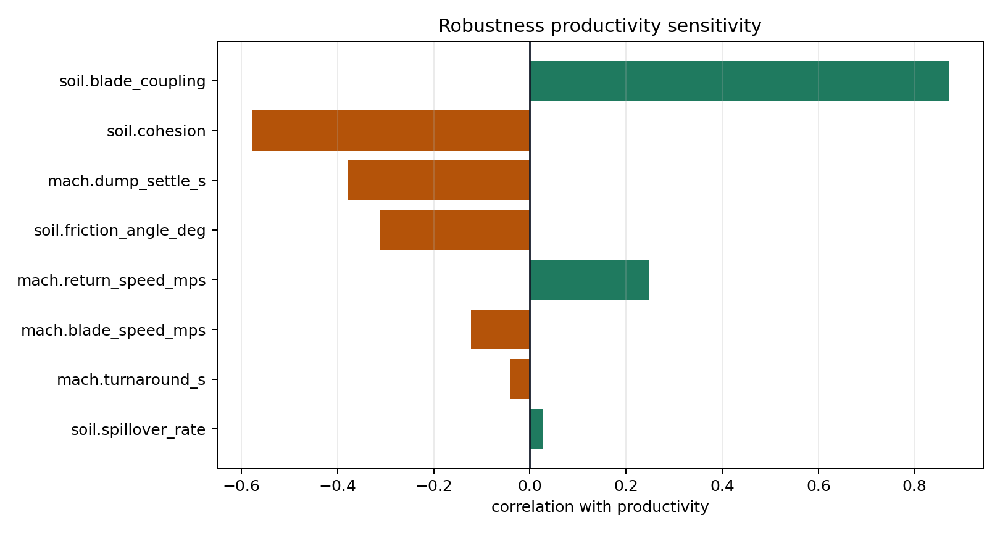

# Robustness Sensitivity

Scenario: `cohesive_soil`
Candidate: `single_pass_wide_cut`
Episodes: `36`
Pass rate: `50%`
Top productivity driver: `soil.blade_coupling` with correlation `0.870`.

## Productivity Drivers

## Ranked Inputs

| input | productivity_correlation | pass_margin_correlation |
| --- | ---: | ---: |
| soil.blade_coupling | 0.870 | 0.830 |
| soil.cohesion | -0.578 | -0.328 |
| machine.dump_settle_s | -0.379 | -0.370 |
| soil.friction_angle_deg | -0.312 | -0.116 |
| machine.return_speed_mps | 0.247 | 0.204 |
| machine.blade_speed_mps | -0.123 | -0.148 |
| machine.turnaround_s | -0.041 | 0.090 |
| soil.spillover_rate | 0.027 | 0.093 |
| soil.compaction_rate | 0.021 | -0.011 |

## Recommendations

- Prioritize measurement and control of `soil.blade_coupling`; productivity tends to increase as it rises.
- Rerun the robustness sweep after tuning the top driver to verify pass-rate improvement.
- Use the ranked inputs to decide which telemetry fields are worth collecting first on a real machine.