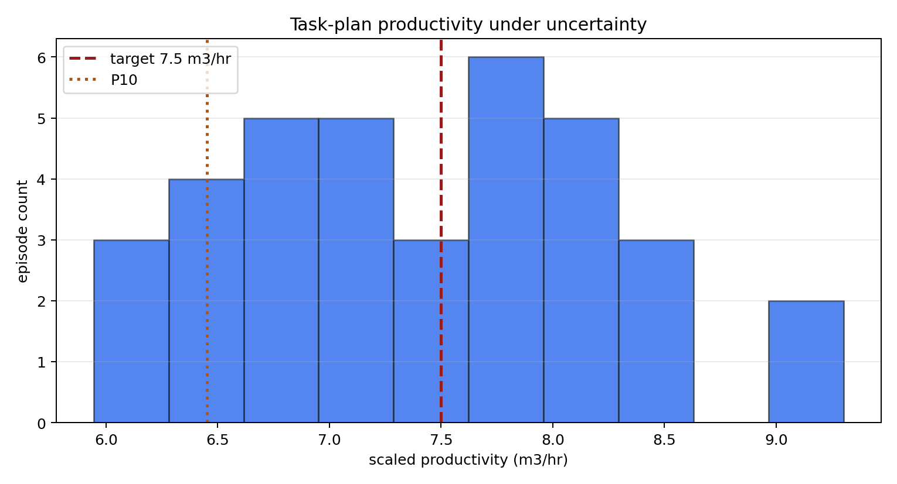

# Task Plan Robustness Sweep

Scenario: `cohesive_soil`
Candidate: `single_pass_wide_cut`

## Summary

- Episodes: `36`
- Pass rate: `50.00%`
- Mean productivity: `7.45` m3/hr
- P10 productivity: `6.45` m3/hr
- Worst productivity: `5.94` m3/hr
- Mean target capture: `0.349`
- Worst failed check: `productivity`

## Productivity Distribution

## Worst Episodes

| episode | decision | productivity_m3_hr | target_capture | terrain_rmse | failed_checks |
| ---: | --- | ---: | ---: | ---: | --- |
| 20 | tune_before_field | 5.94 | 0.359 | 0.014614 | productivity |
| 22 | tune_before_field | 6.09 | 0.357 | 0.014492 | productivity |
| 27 | tune_before_field | 6.22 | 0.340 | 0.014523 | productivity |
| 23 | tune_before_field | 6.41 | 0.341 | 0.014534 | productivity |
| 32 | tune_before_field | 6.50 | 0.335 | 0.014339 | productivity |
| 1 | tune_before_field | 6.56 | 0.344 | 0.014498 | productivity |
| 24 | tune_before_field | 6.56 | 0.351 | 0.014307 | productivity |
| 21 | tune_before_field | 6.65 | 0.343 | 0.014209 | productivity |

## Recommendation

Keep `single_pass_wide_cut` in tuning: pass rate is 50%, with `productivity` as the most common failed check.